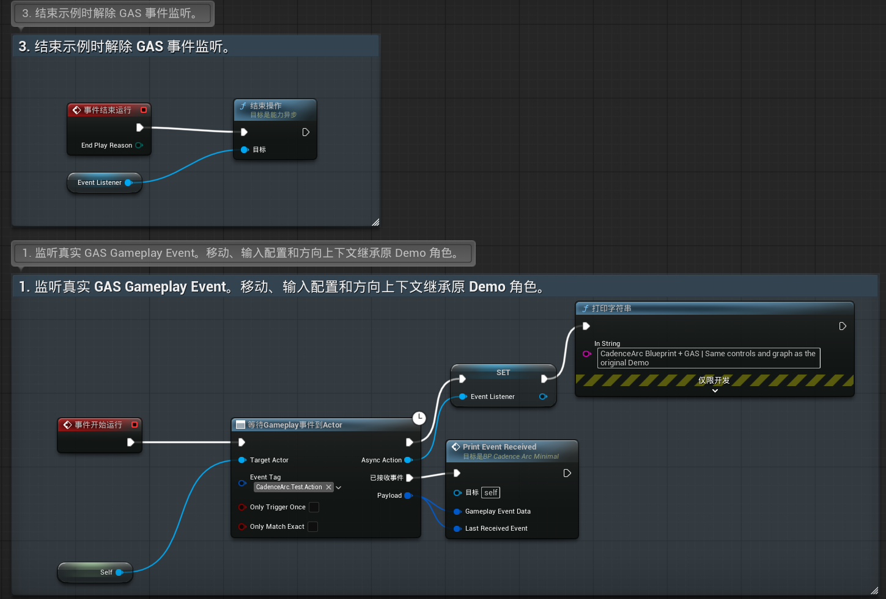

# 蓝图接入

[返回首页](../README.md)

CadenceArc 可以完全在蓝图中接入，不需要编写 C++。本文从动作图和输入资产的配置开始，在角色蓝图中添加组件，再用 `Delay` 模拟动作时长。各接口的完整说明见[CadenceArc 组件](Component.md)和[Enhanced Input 适配](EnhancedInput.md)。

## 准备资产

1. 在 Gameplay Tag 设置中添加输入 Tag 和动作 Tag，例如 `Input.Light`、`Input.Heavy`、`Action.Root`、`Action.Light1`。
2. 新建 `CadenceArcGraph` 数据资产，配置入口节点、节点和转移，规则见[动作图与校验](Graph.md)。
3. 新建 Input Action，例如 `IA_Light` 和 `IA_Heavy`，值类型为 `Digital (bool)`，不加触发器。把它们加入 Input Mapping Context。
4. 新建 `CadenceArcInputActionSet` 数据资产，在 `InputActions` 中为每个 Input Action 填写输入 Tag 和输入方式。需要蓄力的键选择 `HoldIfAvailable` 或 `HoldRelease`，其他键选择 `PressOnly`。

## 角色蓝图

在角色蓝图的 Components 面板中添加两个组件：

| 组件 | 需要设置的属性 |
| --- | --- |
| `CadenceArc` | `Graph`：上一步的动作图 |
| `CadenceArc Input Binder` | `ActionSet`：上一步的映射资产 |

角色被玩家控制后，Input Binder 自动绑定 Input Action，不需要连接任何输入节点。输入方式写在 ActionSet 中，`CadenceArc` 组件的 `InputModes` 可以留空。

Mapping Context 仍按 Enhanced Input 的常规方式添加。第三人称模板已经包含这段逻辑；新建的角色需要在 `BeginPlay` 或 `Event Possessed` 中添加：

```text
Get Controller → Cast To PlayerController
  → Get Enhanced Input Local Player Subsystem
  → Add Mapping Context (Mapping Context = IMC_Default, Priority = 0)
```

## 执行器

选中 `CadenceArc` 组件，在 Details 面板底部的 Events 中点击 `On Action Requested` 旁的加号，创建事件。下面的执行器把每个动作模拟为 0.6 秒：开始后 0.2 秒打开缓冲窗口，0.5 秒关闭，0.6 秒完成。

```text
On Action Requested (Request)
  → Break CadenceArcActionRequest
  → Set CurrentRequestId (Integer64) = Request.RequestId
  → Notify Action Started (Request Id = CurrentRequestId)
  → Print String (Request.TargetActionTag)    ← 在这里播放动作
  → Delay 0.2 → Open Buffer Window (CurrentRequestId)
  → Delay 0.3 → Close Buffer Window (CurrentRequestId)
  → Delay 0.1 → Notify Action Completed (CurrentRequestId)
```

需要注意以下几点：

- 每个请求都必须得到 `Notify Action Started` 或 `Notify Action Rejected`。确认之前，新的输入会返回 `RequestPending`。动作不能执行时，调用 `Notify Action Rejected` 并结束。
- 回调使用变量 `CurrentRequestId`，不直接连接事件的输出引脚。动作完成时消费缓冲产生的下一个请求，会在 `Notify Action Completed` 内部再次触发 `On Action Requested`。
- 一个 `CadenceArc` 组件只能有一个执行器。UI、音效等系统不要订阅 `On Action Requested` 来执行动作。
- `Notify Action Completed` 的调用时刻也是停顿时长的起点。

使用蒙太奇时，可以把 `Delay` 换成 `Play Montage` 节点，按下表连接。这一用法尚未在 Sandbox 中验证。

| `Play Montage` 的输出 | 调用 |
| --- | --- |
| `On Notify Begin`（蒙太奇中的 Play Montage Notify Window 开始） | `Open Buffer Window` |
| `On Notify End` | `Close Buffer Window` |
| `On Completed` | `Notify Action Completed` |
| `On Interrupted` | `Notify Action Interrupted` |

旧蒙太奇的回调可能在下一个请求开始后才到达，例如被下一个动作的蒙太奇打断时触发的 `On Interrupted`。这时 `CurrentRequestId` 已经指向新请求，直接使用会误结束新动作。上面的共享变量示例不适用于这种情况：无论使用蓝图还是 C++，都需要为每次播放单独保存请求编号，让回调携带所属动作的编号。解析器会拒绝编号过期的回调。若蒙太奇中还有其他通知，应先按通知名称筛选缓冲窗口，再调用开关接口。

## Sandbox 示例

[CadenceArcSandbox](https://github.com/1zumiii/CadenceArcSandbox) 的 `Content/Demo/Maps/L_CadenceArcBlueprintDemo` 演示了蓝图执行器的接法。`BP_CadenceArcBlueprintDemo` 继承 C++ 演示角色，沿用其移动、输入配置和方向上下文，并关闭 C++ 执行器（`bAutoExecute = false`），由蓝图事件图处理所有请求。

示例的执行器在确认开始后，向角色自己发送一个真实的 GAS Gameplay Event，事件 Tag 为请求的 `TargetActionTag`，`InstigatorTags` 中带有输入 Tag。没有动画资源时，可以用这种方式检验请求是否能交给 GAS 一侧。缓冲窗口和完成的时序与 C++ 演示执行器相同。


*执行器：上一行确认请求、打印请求编号并发送 GAS 事件；下一行依次打开缓冲窗口、关闭缓冲窗口并完成动作。`Wait for Request` 是一个宏，参数为等待时长和打印文字，等待结束后读取 `CurrentRequest` 的请求编号。宏里包含 `Delay`，所以不能做成函数。*



*事件监听：`BeginPlay` 时用 `Wait Gameplay Event to Actor` 监听 `CadenceArc.Test.Action` 下的事件，并打印收到的事件；`EndPlay` 时结束监听。*

示例使用 Gameplay Abilities 插件发送和监听事件，尚未通过 Ability 执行动作。需要按动作 Tag 激活 Ability 时，可使用 [GAS 执行器](GAS.md)。CadenceArc 插件已声明 Gameplay Abilities 依赖，但核心模块 `CadenceArc` 仍不依赖 GAS。

## 可选功能

**事件上下文**：在角色蓝图的 Class Settings 中，向 Implemented Interfaces 添加 `CadenceArc Input Context Provider`，然后实现 `Collect Input Context` 函数，返回采集时的上下文 Tag，例如按住“前”时返回 `Context.Dir.Forward`。组件处理按下和手动松开、需要采集上下文时调用该接口；自动释放沿用按下时的上下文。

**持久上下文**：状态变化时调用 `Set Context Tags`，传入完整的持久上下文 Tag 集合。例如，起跳时在集合中加入 `State.Air`，落地时移除，再把更新后的集合传给组件。该接口替换整个集合，不是追加单个 Tag。

**蓄力表现**：在 `CadenceArc` 组件的 Events 中添加 `On Hold Stage Changed` 和 `On Hold Ended`，分别播放和清理蓄力特效。

**输入结果**：`Press Input` 等节点返回 `CadenceArcInputResult`，拆开后读取 `Status` 和 `Reason`，可以用于拒绝提示。

**不使用适配组件**：也可以直接放置 Enhanced Input 的 Input Action 事件节点，把 `Started`、`Completed` 和 `Canceled` 分别连接到 `Press Input`、`Release Input` 和 `Cancel Input`，并在 `CadenceArc` 组件的 `InputModes` 中配置输入方式。这种方式需要自行处理失去控制时的清理，详见[Enhanced Input 适配](EnhancedInput.md#失去输入时的清理)。

## 蓝图不可用的接口

以下接口只在 C++ 中提供：

- `SetTimeSource`：替换时间来源。蓝图项目使用默认的 World 游戏时间。
- `SetContextProviderFunction`：以函数提供事件上下文。蓝图使用上面的接口方式。
- `OnActionRequestedNative` 等 Native 委托：与蓝图事件同时发出，内容相同。
- `FCadenceArcInputResult::IsAccepted()`：蓝图中判断 `Status` 是否为 `Request Produced`、`Buffered` 或 `Hold Granted`。
