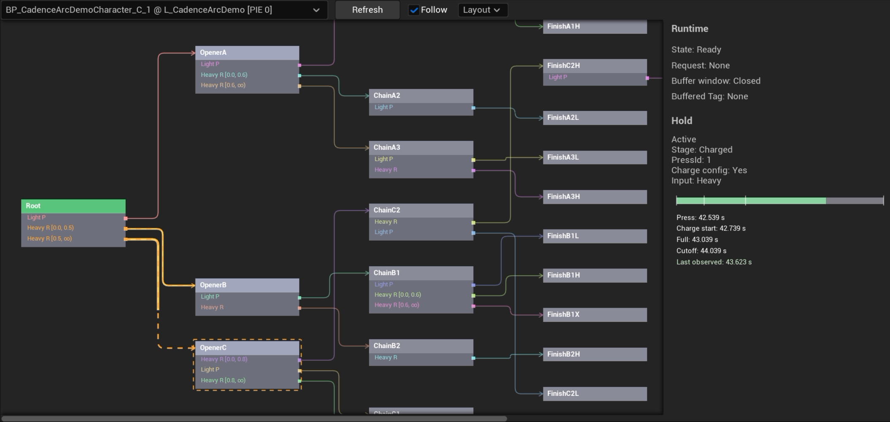
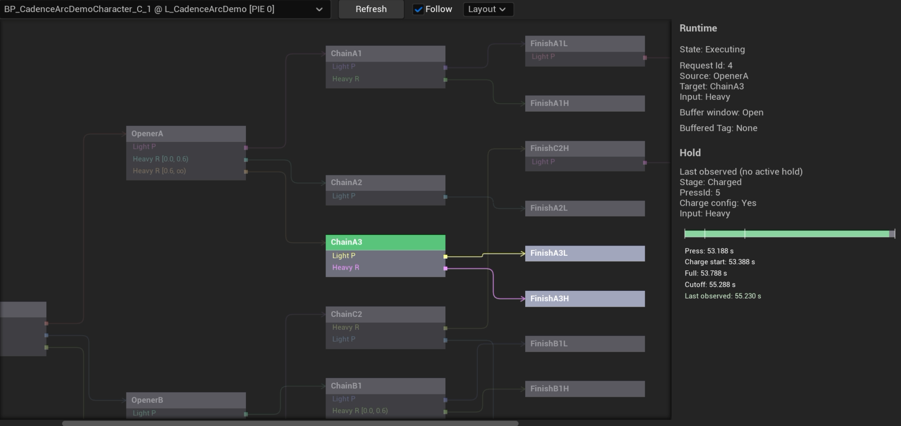
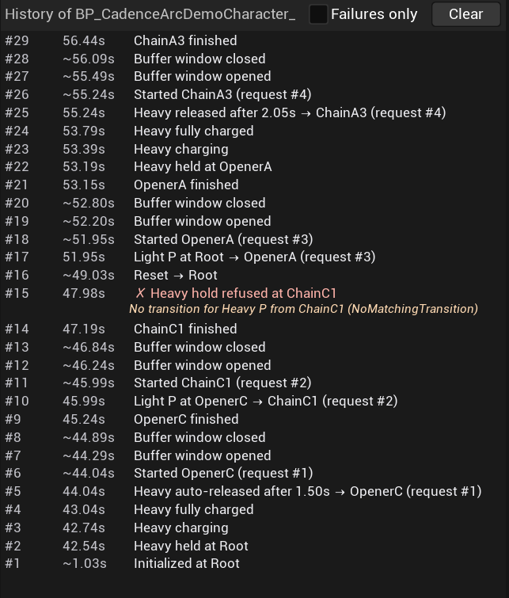

# 运行时调试器

[返回首页](../README.md)

调试器在编辑器内运行（PIE，Play In Editor）期间显示解析器的图、状态和调用记录。调试器位于 `CadenceArcEditor` 模块（`Type=Editor`），不包含在打包后的游戏中。

打开方式：**Tools > Debug** 下的 **Arc Debugger** 和 **Arc History** 两个标签页。两者都只读：不调用会改变状态的解析器 API，不写图资产，运行时也不回调它们。

## Arc Debugger

从下拉框选择一个 PIE 中的解析器（显示为 `Actor @ World`），图和状态随即每帧刷新。

*在 `Root` 按住 Heavy 后，两条 `Released` 边显示为预备边，虚线随蓄力进度填充。`OpenerC` 的虚线框表示当前预览选中的档位。右侧时间轴标出按下、开始蓄力、满蓄力和自动释放的时间点。*

### 图上的颜色

| 显示 | 含义 |
| --- | --- |
| 绿色标题栏 | 已提交的节点 |
| 黄色描边和黄色连线 | 等待 `Started` 的候选请求 |
| 橙色虚线边、进度填充 | 预备边：有按住资格时，这个 Tag 的 `Released` 边 |
| 橙色虚线框 | 按当前预览条件选出的松手档位，限制见下文 |
| 亮色 / 正常 / 变暗 | 分支聚焦：直接后继 / 后续可达节点 / 当前节点不可达的分支 |
| 紫色描边 | Arc History 所选记录对应的节点和边 |
| 虚线回边 | 指向先前节点的转移，经图下方的通道绘制 |

*执行 `OpenerA → ChainA3` 后，动作正在执行，缓冲窗口打开。当前节点的直接后继保持亮色，不可达的分支变暗。*

### 转移条件

端口行在输入名称后显示条件和优先级，例如 `Heavy R [0.8, ∞) +Forward #1`：

| 写法 | 含义 |
| --- | --- |
| `+Forward` | `RequiredContextTags` 中的 Tag |
| `-Air` | `BlockedContextTags` 中的 Tag |
| `pause≥0.3s`、`pause<0.3s`、`pause 0.1–0.3s` | 停顿区间 |
| `#2` | 优先级，为 0 时省略 |

没有条件且优先级为 0 的边，保留原有显示格式。按住期间，预览根据当前持久上下文过滤转移，再选择优先级最高的边。最高优先级存在多个候选时，不标记档位。

当前预览不使用松手事件的上下文，也未接入停顿条件，因此排除所有启用停顿区间的边。预览读取当前图，实际按住解析则使用授予资格时保存的转移副本。因此，方向变化、停顿条件或按住期间的资产修改，都可能使实际结果与预览不同。

### 输入显示

画布左下角固定显示解析器收到的输入，类似格斗游戏训练模式的输入记录：

- 第一行显示持久上下文和停顿时间。`Ready` 时显示距上次完成的时长，例如 `pause 0.42s`；动作执行中提示缓冲输入的停顿时长为 0。
- 有按住资格时多一行：橙色键帽、蓄力阶段和按住时长。
- 最下面显示最近输入，最多 6 次，最新输入在左侧，各组用竖线分隔。事件上下文显示在输入键帽前，例如 `[Forward] + [Light]`。松手键帽带有 `↑`，下方显示按住时长。已缓冲的输入显示蓝框，标记为失败的输入显示红框和 `ignored`。
- 显示内容取自调试历史末尾 64 条记录，最多保留其中最近 6 次输入。键帽不会仅因时间经过而消失；超过 1.5 秒后逐渐变暗。新的历史记录可能使旧输入超出读取范围。

输入显示记录解析器收到的语义输入。单按 W 移动不会产生键帽；提交 Light、Heavy 等事件时，方向作为事件上下文显示。物理按键的显示需要由宿主输入系统实现。

“距上次完成多久”和键帽的年龄，用的是宿主最近一次传给解析器的时间。宿主每帧调用 `AdvanceInputTime` 时，这个时间最多差一帧。

### 浏览

| 操作 | 效果 |
| --- | --- |
| **Follow**（默认开启） | 当前节点变化时，自动缩放（最小 0.6 倍）并滚动，使当前节点及其直接后继尽量进入视图。视图外的后继通过边缘的可点击提示访问。 |
| 右键或中键拖动 | 平移并关闭 Follow |
| Ctrl + 滚轮 | 以鼠标为中心缩放（0.3 倍～2 倍）并关闭 Follow |
| 悬停节点 | 高亮它的连线 |
| 悬停连线 | 高亮两端，显示 `Source → Target · condition` |

### Layout 菜单

这些选项保存在当前用户的编辑器设置中，只影响显示，不修改图资产。

| 选项 | 默认 | 作用 |
| --- | --- | --- |
| Right-angle edges | 开 | 前向边使用水平和竖直线段，竖线在列间空隙中分别占用轨道。关闭后使用平滑曲线，端点不变。 |
| Reorder ports to reduce crossings | 开 | 按转移目标重排节点中的端口行：先排列前向边，再排列引用标签、无效目标、回边和自环。只改变显示顺序，资产中的顺序和解析结果不变。 |
| Compact chains | 关 | 将一进一出的简单链纵向排列在同一个分组框中，减少列数。 |
| References for long edges | 关 | 跨列不少于 N 的边显示为源节点旁的引用标签和目标旁的接入线。前向引用如 `→ SkillF`，回边引用如 `↩ Root`。点击标签定位目标，点击接入线定位源节点。 |
| Input display | 开 | 位于 Overlays 分组，控制左下角输入显示的可见性。 |

### 布局算法

默认是确定性的分层布局（Sugiyama 风格）：

- 从入口深度优先遍历，识别出的回边通过图下方通道绘制为虚线；
- 列号取最长路径，前向边一定指向右侧；
- 长边在经过的每一列预留通道，连线沿节点之间的空闲区域绘制，避免穿过无关节点；
- 布局每帧根据资产重新生成，节点和转移的索引不变。

紧凑链通过增加纵向排列来减少横向列数，仅适用于简单链，不会重新组合分支区域。

## Arc History

Arc History 显示 Arc Debugger 所选解析器的调用记录，按从新到旧排列。成功记录显示一行；失败记录标红，并在下方显示原因说明和枚举名，例如 `No transition for Heavy P from SkillD (NoMatchingTransition)`。

*`~` 表示该时间取自解析器最近一次收到的宿主时间。第 15 条记录是被拒绝的按住资格申请，下方显示拒绝原因。*

执行过转移查询的记录会显示求值时合并后的上下文，例如 `Light P [Forward] at Root → DashStrike`。选中的边启用了停顿条件时，还会显示停顿时长。条件相关的失败会列出候选边未满足的要求：

- `ConditionNotMet`：例如 `No edge for Heavy P at SkillA fits: Dash needs Forward; HeavyB pause 0.10s, needs ≥0.25s. Context: Air, pause 0.10s`。
- `AmbiguousTransition`：列出最高优先级及对应的多个候选边，并提示调整优先级或配置互斥条件。

这些说明根据当前资产中的转移生成。若在 PIE 期间修改图，说明可能与记录产生时的配置不一致。

- **Failures only**：只显示失败。
- **Clear**：隐藏已有的行，不停止记录。
- 选中一行：在图上用紫色标记对应的节点和边，并滚动到相应位置。
- PIE 结束后保留已读取的记录（标题显示 `(ended)`），切换解析器时清空。

### 记录规则

- 历史记录仅在 `WITH_EDITOR` 下编译，打包后的游戏不包含记录代码，Development 配置也不例外。当前没有录制开关。
- 初始化、重置、输入处理、缓冲窗口开关和生命周期入口执行完业务逻辑后，将结果追加到容量为 256 条的环形缓冲。记录满后覆盖最早的一条，通过 `GetDebugHistory()` 读取。查询和 `SetContextTags` 不追加记录。
- `AdvanceInputTime` 仅在经过蓄力阶段、自动释放或调用被拒绝时追加记录。没有阶段变化的逐帧调用不占用历史容量。
- 失败包括：输入未产生请求且未进入缓冲、资格申请被拒绝、松手解析失败、握手结果不是 `Success`、重置或初始化失败，以及完成时丢弃缓冲。完成时没有缓冲，或仍有待松手资格，均不算失败。
- 不带时间戳的调用（`Started`、窗口变化、握手）显示 `~` 加最近一次宿主时间。宿主每帧推进时间，所以最多差一帧。

## 在 Sandbox 中复现问题

Sandbox 的演示执行器有一组 **Debug Scenarios**：

| 选项 | 用途 |
| --- | --- |
| `TimeScale` | 调整执行器计时倍率，便于观察缓冲窗口 |
| `StartDelaySeconds` | 延迟开始，候选请求会停留在黄色状态 |
| `RejectEveryNthRequest` | 每 N 个请求拒绝一次 |
| `bSendStaleCallbacks` | 完成后再次发送旧请求的回调 |

`TimeScale` 不改变图的 `MaxBufferedInputAgeSeconds`。增大执行时长后，原本有效的缓冲输入可能在消费时超过上限。若需同时放慢执行器和解析器使用的 World 游戏时间，可使用控制台命令 `slomo`。
