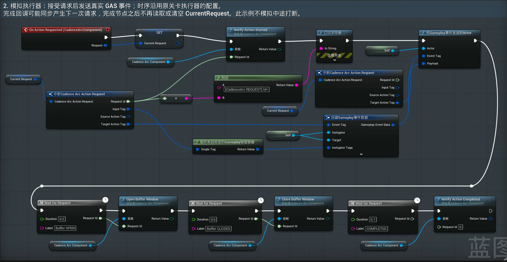

# CadenceArc

[简体中文](README.md) | English

CadenceArc is a data-driven combo resolution framework for Unreal Engine 5. Combo rules are configured as an action graph in a DataAsset, and inputs and actions are identified by semantic GameplayTags. The host submits input events and action lifecycle callbacks to the resolver, which produces action requests from the graph and hands them to an external execution system. The framework does not depend on any particular execution method, such as GAS or animation montages.


*The runtime debugger in PIE: the current action is green and the moves it can branch into next stay bright. The middle panel shows the stages of the latest hold, the bottom-left strip shows recent inputs, and every resolver call is listed on the right.*

## What It Does

```text
InputEvent (InputTag + timestamp)
  -> resolver: resolve now, or buffer while an action runs
  -> ActionRequest
  -> your executor (GAS, montages, a state machine, ...)
  -> handshake callbacks: started, completed, rejected, interrupted
```

CadenceArc only decides which move comes next. How an action plays, deals damage, or animates stays outside the framework. The core module depends only on Engine and Gameplay Tags, not on GAS, animation, or any particular game.

## Features

- **Action graphs**: a `UDataAsset` keyed by Gameplay Tags, validated in the editor.
- **Standard integration component**: `UCadenceArcComponent` handles timestamps, per-frame advance, press/release pairing, input modes, and a single request outlet, and reports input results and hold endings. You configure input modes and the context source once and implement the executor callbacks.
- **Enhanced Input adapter**: the optional `CadenceArcEnhancedInput` module. Map Input Actions to input tags and input modes in a data asset; a component binds them automatically once the pawn is possessed and cancels held inputs when the pawn loses control.
- **Blueprint support**: the component, the input binder, and the context interface all work in Blueprint, so you can integrate without writing C++.
- **Two-phase handshake**: a resolved request commits only when the executor confirms it started; a rejection leaves state unchanged.
- **Input buffering**: an executor-controlled window with a single slot (last input wins) and optional expiry.
- **Hold and charge**: different moves for different hold durations, with charge stages, charge protection, and automatic release.
- **Transition conditions**: the same input can branch on context tags (per input or persistent) and on the pause since the last action, with explicit priorities. Ties are reported, never guessed.
- **Explicit time**: the caller supplies every timestamp; the resolver never reads a clock, so results are deterministic.
- **Runtime debugger**: editor-only live graph view, an input display, and a call history that explains failures, including which condition failed.

## Quick Start

CadenceArc supports both C++ and Blueprint integration. Both use the same assets and components; they differ only in where the executor lives.

Common steps:

1. Put this repository at `Plugins/CadenceArc` in your project (a Git submodule works) and enable the plugin.
2. Create a `CadenceArcGraph` data asset with an entry node, nodes, and transitions.
3. Add a `UCadenceArcComponent` to your character and assign the graph to its `Graph` property. The component handles timestamps, per-frame advance, press/release pairing, and the request outlet. If you need event context such as direction, implement `ICadenceArcInputContextProvider` on the character.
4. With Enhanced Input, create a `CadenceArcInputActionSet` asset that maps each Input Action to an input tag and input mode, then add a `UCadenceArcInputBinderComponent` to the character and assign the asset. It binds automatically once the character is possessed; see [Enhanced Input adapter](Docs/EnhancedInput.md). Use `HoldRelease` for inputs that always wait for release, or `HoldIfAvailable` for inputs that only charge in some actions.
5. Implement an executor: subscribe to `OnActionRequested` and report the action lifecycle back.

### C++

Add `"CadenceArc"` and `"GameplayTags"` to your module's `Build.cs` dependencies, plus `"CadenceArcEnhancedInput"` if you use the Enhanced Input adapter. With another input system, set input modes in the component's `InputModes` and call `PressInput` and `ReleaseInput` from your input bindings.

```cpp
// Input binding without the adapter: the mode comes from InputModes, event context from the character's CollectInputContext
CadenceArcComponent->PressInput(InputTag);
CadenceArcComponent->ReleaseInput(InputTag);

// Executor: every action request arrives here, including the one produced when a buffered input is consumed
void UMyExecutor::HandleActionRequested(const FCadenceArcActionRequest& Request)
{
    if (!CanPlay(Request.TargetActionTag))
    {
        CadenceArcComponent->NotifyActionRejected(Request.RequestId);
        return;
    }
    CadenceArcComponent->NotifyActionStarted(Request.RequestId);
    PlayAction(Request); // call CadenceArcComponent->NotifyActionCompleted(Request.RequestId) when it ends
}
```

See [CadenceArc component](Docs/Component.md) for the full interface. Tests, replays, and other cases that need direct control over time can use `UCadenceArcResolver` without the component.

### Blueprint

Blueprint-only projects write no C++ and leave `Build.cs` untouched. Add `On Action Requested` from the `CadenceArc` component's Events, then confirm the request, open and close the buffer window, and report completion in the event graph:



*The Blueprint sample in the Sandbox: the top row confirms the request and sends a GAS event; the bottom row opens the buffer window, closes it, and completes the action.*

See [Blueprint integration](Docs/Blueprint.md) for the full steps.

A complete, playable example lives in [CadenceArcSandbox](https://github.com/1zumiii/CadenceArcSandbox): `L_CadenceArcDemo` uses C++ and a Timer-based demo executor, and `L_CadenceArcBlueprintDemo` uses Blueprint only. Both include hold input and transition conditions.

## Documentation

The detailed docs are written in Chinese.

| Document | Covers |
| --- | --- |
| [CadenceArc component](Docs/Component.md) | The standard integration: what the component handles, setup, interface, time source |
| [Enhanced Input adapter](Docs/EnhancedInput.md) | Optional module: bind Input Actions to the component from a data asset, cleanup on lost input, trigger setup |
| [Blueprint integration](Docs/Blueprint.md) | Minimal Blueprint-only setup: assets, components, executor, optional features |
| [Resolver: handshake, buffering, and time](Docs/Resolver.md) | States and lifecycle, executor integration, result types, buffer windows, time and expiry, context and pause |
| [Hold input](Docs/HoldInput.md) | Release tiers, charge configuration, per-frame advance, host integration notes |
| [Action graph and validation](Docs/Graph.md) | Graph fields, transition conditions and priorities, validation rules |
| [Runtime debugger](Docs/Debugger.md) | Arc Debugger, condition labels, input display, Arc History, layout options, Sandbox debug scenarios |
| [Testing](Docs/Testing.md) | How to run the tests and what each file covers |
| [Migration notes](Docs/Migration.md) | Breaking changes since earlier development versions |

## Status

CadenceArc is `0.5.0-alpha` and experimental; the API and asset format may change before the first stable release.

- Done: core resolution and handshake, buffering and expiry, hold and charge (Phase 6), runtime debugger (Phase 7), transition conditions and priorities (Phase 8).
- Done: the standard integration component, the Enhanced Input adapter, and the Blueprint API. The Blueprint sample in the Sandbox has been verified in PIE.
- The hold API has not been used in a shipped game yet, so its ergonomics may still change.
- The Sandbox uses a Timer-based demo executor; CadenceArc has not yet been tested with an animation montage executor.

Roadmap:

1. More expiry policies, and an optional combo timeout that returns to the entry.
2. Optional execution adapters, including GAS.
3. Input recording, replay, networking, and prediction research.

## Requirements

- Unreal Engine 5.7 and a supported C++ toolchain
- The Enhanced Input plugin (enabled by default in the engine; this plugin declares the dependency)
- Git LFS for binary Unreal assets
