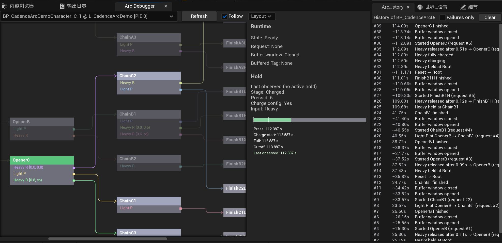

# CadenceArc

[English](README.md) | 简体中文

CadenceArc 是 Unreal Engine 5 的分支连招框架。你在一张动作图里配置“在哪个动作、按了什么、接下来做什么”，它把输入解析成动作请求，交给你自己的执行系统去播放。



*PIE 中的运行时调试器：绿色是当前动作，亮色是接下来能走的招式，右侧是每一次调用的历史。*

## 它做什么

```text
输入事件 (InputTag + 时间戳)
  -> 解析器：立即解析，或在动作执行期间缓冲
  -> ActionRequest
  -> 你的执行器（GAS、蒙太奇、状态机……）
  -> 握手回调：开始、完成、拒绝、打断
```

CadenceArc 只负责“下一招是什么”。动作怎么执行、伤害怎么算、动画怎么播，都在框架之外。核心模块只依赖 Engine 和 Gameplay Tags，不依赖 GAS、动画或任何具体游戏。

## 功能

- **动作图**：`UDataAsset` 配置，用 Gameplay Tag 描述动作和输入，编辑器里自动校验。
- **两阶段握手**：解析出的请求要等执行器确认开始才提交，被拒绝时状态不变。
- **输入缓冲**：执行器控制的缓冲窗口，只有一格，后来的输入覆盖先前的，可以设置过期时间。
- **按住与蓄力**：同一个键按不同时长触发不同招式，支持蓄力阶段、蓄力保护和自动松手。
- **显式时间**：时间全部由调用方提供，解析器不读时钟，结果完全确定。
- **运行时调试器**：仅编辑器，实时显示图和状态，列出每次调用和失败原因。
- **自动化测试**：110 多个 Unreal 自动化测试，覆盖边界时间、过期回调和失败时状态不变。

## 快速开始

1. 把本仓库放到项目的 `Plugins/CadenceArc`（可以作为 Git 子模块），在编辑器里启用插件。
2. 在你的模块的 `Build.cs` 里加上依赖 `"CadenceArc"` 和 `"GameplayTags"`。
3. 新建一个 `CadenceArcGraph` 数据资产，配置入口节点、节点和转移。
4. 在执行器里创建解析器，把输入和生命周期回调接进去：

```cpp
Resolver = NewObject<UCadenceArcResolver>(this);
Resolver->Initialize(ComboGraph);

// 输入：可能立即产出请求
const FCadenceArcSubmitOutcome Submit = Resolver->SubmitInput(InputEvent);
if (Submit.HasActionRequest())
{
    StartRequest(Submit.GetActionRequest()); // 能执行就调 NotifyActionStarted，否则 NotifyActionRejected
}

// 动作完成：缓冲的输入可能产出下一个请求
const FCadenceArcActionCompletionOutcome Completion = Resolver->NotifyActionCompleted(RequestId, NowSeconds);
if (Completion.HasNextActionRequest())
{
    StartRequest(Completion.GetNextActionRequest());
}
```

完整的可运行示例在 [CadenceArcSandbox](https://github.com/1zumiii/CadenceArcSandbox)：它用 Enhanced Input 和一个基于 Timer 的演示执行器驱动 CadenceArc，包括按住输入。

## 文档

| 文档 | 内容 |
| --- | --- |
| [解析器：握手、缓冲与时间](Docs/Resolver.md) | 状态与生命周期、执行器接入、结果类型、缓冲窗口、时间与过期 |
| [按住输入](Docs/HoldInput.md) | 松手档位、蓄力配置、每帧推进、宿主接入注意事项 |
| [动作图与校验](Docs/Graph.md) | 图的字段和校验规则 |
| [运行时调试器](Docs/Debugger.md) | Arc Debugger、Arc History、布局选项、Sandbox 调试场景 |
| [测试](Docs/Testing.md) | 怎么运行，每个测试文件覆盖什么 |
| [迁移说明](Docs/Migration.md) | 早期开发版之后的不兼容改动 |

## 状态

当前版本 `0.4.0-alpha`，还在实验阶段，稳定版之前 API 和资产格式都可能变化。

- 已完成：核心解析与握手、输入缓冲与过期、按住与蓄力（Phase 6）、运行时调试器（Phase 7）。
- 进行中：转移条件与优先级（Phase 8）。
- 按住相关的 API 还没有在上线的游戏里用过，易用性可能还会调整。

路线图：

1. 转移条件与优先级、更多过期策略、可达性分析；
2. 可选的执行适配层，包括 GAS；
3. 输入录制、回放、联网和预测的研究。

## 环境要求

- Unreal Engine 5.7 和对应的 C++ 工具链
- Git LFS（管理 Unreal 二进制资产）
